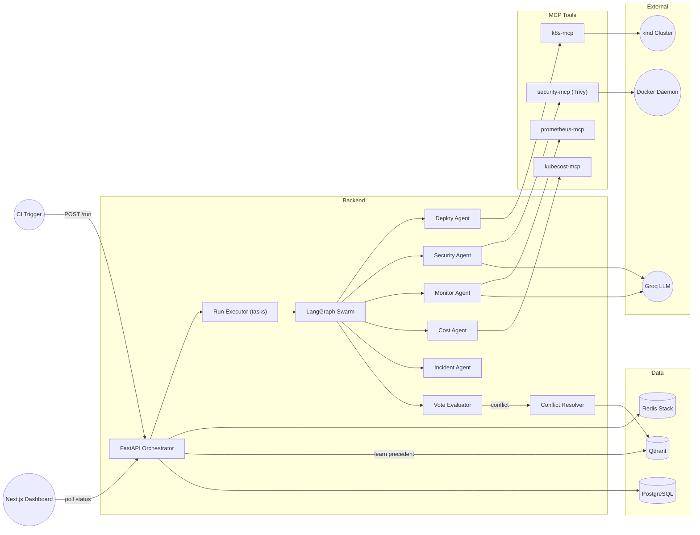
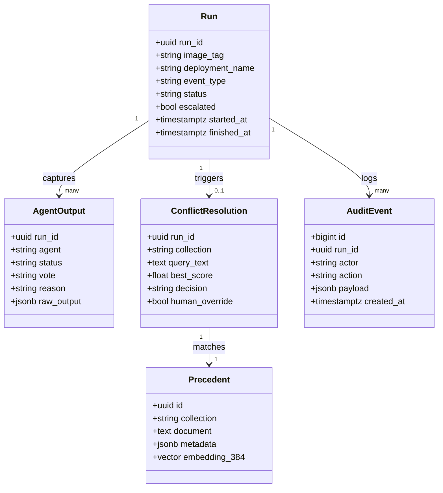
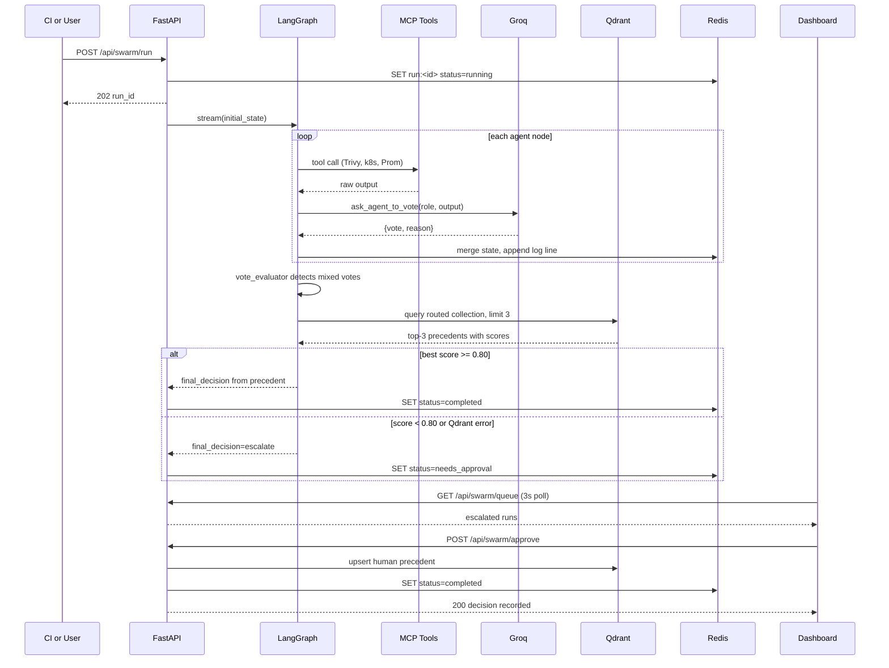

# DevSwarm — System Design

> Autonomous multi-agent CI/CD orchestrator (LangGraph + FastAPI) that uses RAG over
> deployment precedents (Qdrant) to resolve inter-agent conflicts, escalating to a human
> when retrieval confidence is low. Zero-budget, local-only (Docker Compose + `kind`).

Paste the Mermaid blocks below into Excalidraw via **More tools → Mermaid to Excalidraw** for editable versions.

---

## 1. Requirements & Assumptions

### Functional Requirements

| ID | Requirement | Priority |
|---|---|---|
| FR1 | Ingest pipeline events (push, alert, cron, CVE) and start a swarm run | Must |
| FR2 | Deploy Agent builds image, applies manifest to `kind`, checks rollout via k8s-mcp | Must |
| FR3 | Security Agent runs real Trivy scan; can vote `block` | Must |
| FR4 | Incident Agent reads Prometheus signals via prometheus-mcp; can vote `rollback` | Must |
| FR5 | Monitor / Cost Agents vote `proceed`/`block`/`monitor` (Cost pricing is simulated, disclosed) | Must |
| FR6 | Vote Evaluator detects mixed votes; Conflict Resolver queries Qdrant (top-3, per-collection routing) | Must |
| FR7 | Confidence >= 0.80: autonomous decision from precedent metadata; below 0.80: escalate | Must |
| FR8 | Human approves/overrides on dashboard; decision written back to Qdrant (learning loop) | Must |
| FR9 | Every agent output, vote, and resolution persisted for audit + precedent mining | Must |
| FR10 | Dashboard shows live run status, decision trail, and approval queue (polling) | Must |

### Non-Functional Requirements (with stated assumptions)

| Property | Target | Basis |
|---|---|---|
| Users | 1 team (5 people, 2 active builders) + grader audience | PRD 5/8 |
| Run volume | ~40 runs/day (CI pushes + manual demos + viva) | assumption, 2-3x current demo rate |
| Throughput | < 0.01 QPS average, < 0.05 QPS peak | 40/86,400 x 5x peak factor |
| Concurrency | <= 5 simultaneous runs; burst <= 20 | one team's worth of pipelines |
| Run latency | p50 ~30 s; p99 <= ~6 min | Trivy scan dominates (320 s hard timeout) + 4 LLM votes |
| Availability | 99% during working hours is acceptable (local, single dev host) | zero budget, academic scope |
| Durability | A started run must not silently vanish; decisions must survive restarts | FR9 |
| Consistency | Strong (single writer per run); no stale-read tolerance needed | trivial write concurrency |
| Security | No secrets in logs/state; LLM key never reaches Redis/Qdrant; local network only | existing `redact_secrets`, zero-egress budget |

### Constraints

- **Zero budget** — everything runs on Docker Compose + `kind` on one machine; no cloud, no paid tiers (Groq free tier is the only external call).
- **2 active engineers**, 16-week timeline, academic deliverable (demo + viva + report).
- **Local-only, non-HA by explicit non-goal** (PRD 4) — no multi-node, no multi-tenant, no multi-cluster.
- **Python-first team** — no willingness to maintain a second language stack.
- **Novelty anchor** — the RAG precedent-resolution loop must stay clearly visible and explainable; architecture choices that obscure it (e.g., an opaque event mesh) are disqualifying.

---

## 2. Capacity Estimation

### Traffic

```
Avg QPS  = 40 runs/day / 86,400 s/day            = 0.0005 QPS
Peak QPS = avg x 5 (morning push storm)          = 0.0025 QPS
Dashboard polling  = 5 users x 1 req / 3 s       = 1.7 QPS (reads only)
```

**< 5 QPS total at peak. A single laptop handles ~10,000x this.**

### Latency (per run, sequential chain)

```
Deploy agent   : docker build (cached 10-60 s) + k8s apply + rollout check   ~30 s
Security agent : Trivy scan (up to 320 s hard timeout) + LLM vote            ~60-320 s
Monitor / Cost : Prom query + LLM vote                                         ~5 s each
Incident agent : Prom queries + LLM vote                                       ~5 s
Conflict RAG   : embed (CPU, bge-small 384-d) + Qdrant top-3                   ~1 s
p50 = 30-60 s (clean scans);  p99 = 5-6 min (Trivy-bound)
```

### Storage (per year)

| Store | Math | Size/yr |
|---|---|---|
| Redis (run docs, ~50 KB each incl. scan JSON) | 40/day x 50 KB x 365 | ~0.7 GB raw; 7-day TTL keeps steady state ~400 KB |
| Qdrant (precedents: ~1 KB text + 384 x float32 = 1.5 KB vec + idx) | 40/day x ~4 KB x 365 | ~60 MB |
| Postgres (audit: ~10 events/run x 2 KB) | 40 x 10 x 2 KB x 365 | ~300 MB |
| **Total (x3 replication)** | | **< 3 GB/yr** |

### Bandwidth

```
40 runs/day x ~150 KB state movement + polling  < 10 MB/day. Negligible.
```

### Conclusion the numbers force

This is a **single-node monolith**. One FastAPI process, one Redis, one Qdrant, one
Postgres, all in one compose file. Microservices, a broker, sharding, or multi-AZ
would add ops cost with zero benefit at < 5 QPS. The design pressure here is not
throughput — it is **correctness of the decision pipeline, durability of in-flight
runs, and explainability**. Those are the things the rest of this doc optimizes for.

---

## 3. High-Level Architecture



**Primary request path (sync):**
`POST /api/swarm/run` validates the payload (pydantic), writes `run:<id>` with
`status=running` to Redis, schedules the swarm execution off the request path, and
returns `202 {run_id}` immediately.

**Primary async path (the swarm):**
The executor streams the compiled LangGraph: `deploy -> security -> monitor -> cost
-> incident -> vote_evaluator`. Each agent node calls its MCP tools (Trivy
subprocess, k8s API, Prom queries) and one Groq LLM vote, then writes its output
into shared state. The evaluator sets `conflict_flag` on mixed votes. On conflict,
the `conflict_resolver` textifies the conflict, routes the query to the Qdrant
collection owned by the latest blocking agent, fetches top-3 precedents, and either
adopts the best precedent's `decision` (score >= 0.80) or sets
`final_decision=escalate`. Every state update is merged into the Redis run doc so
the dashboard can poll a live decision trail. On escalation the run parks at
`needs_approval` until `POST /api/swarm/approve` records the human decision and
writes a new precedent to Qdrant — closing the learning loop.

**Event path (planned, stubbed in `event_router.py`):** external triggers (GitHub
webhook, Prometheus alert, cron, CVE feed) map `event_type -> path`. v1 keeps the
REST trigger; the router shape is already in place, so a webhook endpoint is a
small add, not a redesign.

---

## 4. Data Model & Database Choice

### Engine choice

| Store | Engine | Justification |
|---|---|---|
| Run state (hot) | **Redis Stack (RedisJSON)** | Sub-ms reads for the polling dashboard, one atomic JSON doc per run, TTL retention. It is a *cache-shaped* source of truth — acceptable because the durable copy goes to Postgres and the loss case (restart mid-run) is explicitly handled in 7.3. |
| Audit / decisions (durable) | **PostgreSQL 15** | FR9 requires every decision persisted for precedent mining and the report. Relational, transactional, trivially small. (Removed from final design to optimize resources; Redis + Qdrant handle all state). |
| Precedents (vectors) | **Qdrant** | The product's core novelty *is* vector precedent retrieval; Qdrant gives HNSW ANN, payload filtering, and a clean HTTP API for learning-loop writes. |

**Rejected alternative — Redis as the *only* store (status quo).** It works for the
demo, but RDB snapshots can lose in-flight runs, `KEYS run:*` is an O(N) scan, and
there is no durable, queryable decision history for the report. (Note: For the final MVP, we stayed with Redis to avoid unnecessary Postgres overhead).

**Rejected alternative — pgvector instead of Qdrant.** Honest note: at < 100K
vectors pgvector is a legitimate, *simpler* choice (one fewer engine, per the
polyglot rule). Qdrant is kept because (a) the team already built and seeded
against it, (b) the viva narrative centers on a dedicated vector store, and
(c) swapping later is cheap — precedents are just text+metadata. **If ops burden
becomes a problem, migrate to pgvector; the data is portable by design.**

### Data model



### Explicit indexes for primary access patterns

**Postgres** (mirrors the dashboard/report queries):

| Index | Pattern served |
|---|---|
| `run_id` FK on `agent_outputs`, `audit_events`, `conflict_resolutions` | "show me everything about run X" |
| `(status, started_at DESC)` on `runs` | active/escalated runs, recency-sorted |
| `created_at DESC` on `audit_events` | report timeline, MTTR analysis |
| partial `WHERE status = 'needs_approval'` on `runs` | approval-queue hot path (small, always polled) |

**Qdrant:** HNSW payload indexes on `metadata.decision` and `metadata.severity`
for filtered retrieval; no further indexing needed at 40 docs/day.

**Redis:** none — single JSON doc per run, TTL 7 days; the queue query becomes a
Postgres index scan once wired (kills `KEYS run:*`).

---

## 5. API Design

**Protocol: REST/JSON** over HTTP. Chosen because the clients are one dashboard +
CI scripts (no chatty aggregation needs), and status codes map cleanly to pipeline
semantics. Add a `/v1` prefix before a second consumer appears.

**Semantics:**

- `202` + `run_id` for async starts; clients poll `status` (no websockets at this scale).
- `404` unknown run; `409` approving a non-escalated run (currently returns 200 + error JSON — fix to proper codes); `422` validation; `503` when Redis is down (already implemented for `/run`).
- **Idempotency:** `POST /api/swarm/approve` must be idempotent — re-approving a
  completed run returns the stored decision (it currently re-writes and re-learns a
  duplicate precedent; dedupe on `run_id`).
- **Rate limiting:** not needed for the team; a 60 req/min/IP default is the only
  guard required against an accidental polling loop.

### Key endpoints

| Method | Path | Purpose | Notes |
|---|---|---|---|
| POST | `/api/swarm/run` | Start a swarm run for an image | body `{image_tag, deployment_name}`; returns `202 {run_id}`; 503 if Redis unavailable |
| GET | `/api/swarm/status/{run_id}` | Poll run state, logs, decision trail | 404 if unknown; 7-day retention |
| GET | `/api/swarm/queue` | List escalated runs for approval | backed by Postgres `status='needs_approval'` index (replaces `KEYS run:*`) |
| POST | `/api/swarm/approve` | Human decision on an escalated run | body `{run_id, decision}`; 409 if not escalated; idempotent on `run_id`; writes precedent to Qdrant |
| POST | `/api/events` | Ingest external trigger (webhook/cron) | stubbed in `event_router.py`; HMAC signature verified once GitHub is wired |
| GET | `/healthz` | Liveness | process up |
| GET | `/readyz` | Readiness (deep) | checks Redis ping, Qdrant collections, Groq key present; 503 naming the failed dependency |

---

## 6. Tech Stack

| Layer | Choice | Why | Rejected alternative & why |
|---|---|---|---|
| API | **Python 3.11 + FastAPI** | pydantic validation at the boundary, async, zero team learning cost, already built | Node/NestJS: no benefit, would rewrite the backend; Django: batteries (admin/auth) unused here |
| Orchestration | **LangGraph (StateGraph)** | The swarm *is* the graph; conditional edges express the conflict branch declaratively; state is inspectable for the decision trail | Raw asyncio/CEL: would hand-roll state management and the evaluator; Airflow: wrong shape (workflow-as-data, not a decision pipeline) |
| Agent tools | **MCP servers (FastMCP)** | Agents call tools through a stable contract; Trivy/k8s/Prom are swappable without touching agent logic — an explicit project goal | Direct imports: what Phase 1 had; couples every agent to one tool implementation |
| LLM | **Groq (free tier), gpt-oss-120b** | Zero budget, fast inference, OpenAI-compatible SDK | Self-hosted LLM: no GPU budget; local CPU LLM: vote latency would blow the run budget. Cost: external dependency + rate limits (mitigated in 7.3) |
| Run state (hot) | **Redis Stack (RedisJSON)** | < 1 ms reads for 3 s polling; atomic JSON doc per run; TTL retention | Postgres-only for run state: works, but polling latency and churn are worse; keep Redis hot, Postgres truth |
| Precedent store | **Qdrant + fastembed (bge-small-en-v1.5, 384-d)** | Dedicated ANN, payload filtering, trivial learning-loop writes; anchors the novelty claim | pgvector: simpler ops, viable at this size — rejected on narrative/momentum grounds, documented as the migration path (4) |
| Durable store | **PostgreSQL 15** | Audit trail, decision mining for the report, kills `KEYS run:*` | SQLite: fine, but Postgres is already in compose and is the boring, defensible default |
| Frontend | **Next.js + React + Tailwind** | SPA dashboard, 3 s polling, one client | GraphQL: one CRUD client, no aggregation pain; WebSocket/SSE: 3 s polling is indistinguishable to a human and removes stateful connections |
| Container/orch | **Docker Compose + kind** | The PRD constraint *is* the stack; one `docker compose up` reproduces everything | Kubernetes for DevSwarm itself: running a 3-service system on K8s to demo K8s deployment is a tax, not a feature (kind remains the *test target*) |
| CI | **GitHub Actions (free)** | Real CI trigger for demo scenario A; zero budget | Local scripts only: weaker demo story |

---

## 7. Deep Dives

### 7.1 Critical flow — conflict detection, RAG resolution, human escalation



### 7.2 Caching strategy

- **Run state (single writer, TTL as retention):** Redis holds the hot copy of the
  run doc. One writer (the executor) per run, so there is no invalidate-on-write
  race within a run. On approval the doc is re-set whole (delete-then-set, not
  field-patch, to avoid partial JSON). TTL 7 days on `run:*` bounds memory; the
  durable copy is Postgres.
- **Trivy scan results (first cache to add at 10x):** key by **image digest**, not
  tag — `trivy:<sha256>`, 24 h TTL. Re-scanning the same image every run is the
  dominant latency cost and pure waste; this one cache cuts p99 from ~6 min to
  ~30 s for repeat tags. Miss: run scan, then populate.
- **Qdrant is not a cache** — it is the source of truth for precedents. No TTLs;
  retention is a product decision (the report needs the full history).
- **Failure modes:** Redis down: `/run` returns 503 (already coded), dashboard
  shows "state unavailable", no corruption because Postgres holds the audit copy.
  Qdrant down: resolver **fails safe to `escalate`** (already coded) — a wrong
  autonomous deploy is worse than a human interrupting a demo.

### 7.3 Queuing & resilience — failure modes, stated explicitly

| Dependency fails | Current behavior | Assessment |
|---|---|---|
| Groq API (down/429) | `ask_agent_to_vote` returns `vote=block` | **Correct (fail-closed).** A pipeline must not auto-proceed on missing security input. Add: 3 retries with exponential backoff + jitter before failing closed. |
| Qdrant down | Resolver catches, sets `final_decision=escalate` | **Correct (fail-safe to human).** Add: metric; alert if > 0 in an hour. |
| Trivy timeout (320 s) | Subprocess timeout, agent votes `block` | Acceptable; the digest cache (7.2) avoids most of it. |
| Redis down at start | `503` on `/run` | Correct — no run without state storage. |
| **API process restarts mid-run** | **Run orphaned in `status=running` forever; no retry, no recovery** | **The weakest link.** In-process `BackgroundTasks` give no durability. Fix (10x plan, step 1): move the executor to a **durable task queue on Redis** (ARQ or Celery — Redis is already there, no new engine). On startup, a recovery job re-queues `running` runs older than their expected duration. |
| Duplicate approve calls | Re-writes precedent, duplicate learned data | Fix: idempotency by `run_id` (unique constraint on `conflict_resolutions.run_id`), return stored decision on replay. |
| Poison state (malformed agent output) | `json.loads` guarded; invalid becomes `block` | Already fail-closed; keep. |

**Resilience rules adopted:** timeout on every external call (Groq, Trivy, k8s —
present or to be added); retries with jitter only on idempotent read calls (Qdrant
queries, Prom queries); `apply_manifest` is idempotent by k8s resource name, which
makes retry safe — document this; circuit breaker on Groq after 5 consecutive
failures, fail-closed for 60 s.

---

## 8. Security & Observability

### Authn / Authz

- **v1 (local, honest baseline):** no authentication — the system binds to the dev
  host / compose network behind no public edge. State this in the report.
- **Minimum production-grade posture (before any public deployment):**
  - Dashboard: **server-side sessions** (short-lived, HttpOnly, SameSite=Lax) —
    instant revocation, simpler than JWT for a single-domain internal tool.
  - CI webhook ingress (`/api/events`): **HMAC signature verification**
    (GitHub-style) + webhook secret allowlist.
  - Authz: two roles only — `viewer` (poll status/queue) and `operator`
    (start runs, approve). Approval is a privileged act (it can ship or roll back)
    and must be the only role reaching `POST /api/swarm/approve`.
- **CORS:** `allow_origins=["*"]` is a demo convenience; pin to the dashboard
  origin in any non-local deploy.

### Transport & data security

- TLS at the edge (Caddy/nginx in compose, or the host reverse proxy) — plain HTTP
  is acceptable only on the loopback/compose network.
- Secrets: `GROQ_API_KEY`, DB creds from env/`.env` (gitignored — verify in CI with
  gitleaks), never hardcoded (the compose file currently contains the Postgres
  password in plaintext — fine locally, must move to `.env` for any shared use).
- **Secrets in logs/state:** `redact_secrets()` masks `gsk_...`/`sk-...`/`ghp_...`
  before anything touches Redis or the dashboard. Extend the pattern list
  (kubeconfig tokens, cloud keys) and apply it at the *agent output* boundary, not
  just the log line, so raw MCP output cannot leak into Postgres either.
- Input validation: pydantic at every endpoint boundary (present); additionally
  whitelist `vote` to `{proceed, block, rollback, monitor}` (done in `llm_utils`),
  `decision` to `{proceed, rollback}` on approve (add), and constrain `image_tag`
  to a tag grammar (note: it is interpolated into a `docker run` argument list,
  not a shell string — safe as-is, but the grammar check is cheap insurance).

### Audit logging

Every significant step writes an `AuditEvent` (actor = agent name or human,
action, payload): run started, each vote, conflict detected, Qdrant query
(collection, score, top-3 ids), decision (auto vs human), precedent upserted.
Append-only table; no UPDATE/DELETE grants for the app role. This is simultaneously
FR9, the viva's "explain the decision path" evidence, and the precedent-mining
source for re-seeding Qdrant.

### Observability stack (boring, local-friendly)

- **Logs:** structured JSON to stdout (run_id, node, duration) — collected by
  Docker, grep-able today; Loki later only if volume demands it.
- **Metrics** (Prometheus is already a dependency via prometheus-mcp, so expose
  `/metrics` on the FastAPI app):
  - `devswarm_runs_total{status}` (completed/escalated/failed)
  - `devswarm_conflict_rate` (conflicts / runs)
  - `devswarm_auto_resolution_rate` (auto-decided / conflicts) — the headline
    metric for the novelty claim
  - `devswarm_run_duration_seconds` histogram (Trivy-bound tail visible)
  - `devswarm_llm_errors_total`, `devswarm_qdrant_query_seconds`
- **Traces:** skip at this scale; the LangGraph state stream + run_id correlation
  in logs is the trace. Add OpenTelemetry only if a second backend service appears.
- **Health:** `/healthz` shallow (process), `/readyz` deep (Redis ping, Qdrant
  collections list, Groq key present) — compose healthchecks and any future
  ingress use `/readyz`.
- **Alerting (symptom-based):** run stuck `running` > 15 min; escalation queue
  depth > 0 for > 1 h; auto-resolution rate < 30% over 20 runs (tells you the
  0.80 threshold or precedent quality is off — a *product* alert, not an infra one).

---

## 9. Trade-offs, Risks & 10x Plan

### Decision table (accepted trade-offs)

| Decision | Alternative | Why rejected | What we gave up |
|---|---|---|---|
| Monolith (FastAPI + in-process LangGraph) | Per-agent microservices | 5 QPS; 2 engineers; one deploy must stay trivial | Agents cannot scale independently (moot at this scale); one process crash domain |
| In-process `BackgroundTasks` executor | Durable task queue (ARQ/Celery/Kafka) | Fastest path to a working demo; zero new infra | **In-flight runs lost on API restart** — accepted for v1, first item of the 10x plan |
| Redis as hot run store | Postgres-only | 3 s polling wants sub-ms reads; atomic JSON doc per run | One more engine + a truth split (mitigated: Postgres audit is canonical) |
| Qdrant over pgvector | pgvector | Novelty narrative + dedicated ANN + already built | One more engine to run/back up (acceptable: one container, one volume) |
| Sequential agent chain | Parallel fan-out (PRD FR2 hints at parallel Deploy+Security) | Sequential LangGraph edges are trivially debuggable; latency is Trivy-dominated, so parallelism saves only ~1 LLM call's time | ~2-5 s per run; PRD "parallel with Security" is unimplemented (disclose in report) |
| Dashboard polling (3 s) | WebSocket/SSE | No stateful connections, survives restarts, zero human-perceptible difference | ~1.7 QPS of trivial reads; up to 3 s stale UI |
| Groq free tier | Self-hosted LLM | Zero budget, no GPU; OpenAI-compatible SDK keeps an exit open | External dependency, rate limits, key in env; fail-closed masking (7.3) |
| Fail-closed on LLM error (`block`) | Retry-forever / fail-open | A silent auto-proceed on missing security input is an unacceptable incident | Runs blocked during Groq outages (correct cost) |
| `kind` as deployment target | Managed K8s (EKS) | PRD zero-budget constraint; `kind` exercises the same k8s API | No real cluster-scale failure modes (documented non-goal) |

### Single points of failure

| SPOF | Blast radius | Status |
|---|---|---|
| Single uvicorn process | All runs + dashboard API | **Accepted** (local). Mitigation: restart policy + startup recovery job when the queue lands |
| Single Redis (default RDB persistence, no replica) | Run state lost between snapshots | Mitigation: enable AOF `everysec`; Postgres audit remains canonical |
| Single Qdrant (one volume) | Precedent memory lost | Mitigation: nightly snapshots + volume backup; re-seed script exists (`seed_qdrant.py`) |
| Groq API (external) | All agent voting goes fail-closed | Mitigated: retries + circuit breaker + block is the safe state |
| Single Docker host / kind cluster | Everything | Accepted — local academic system; the recorded demo is the DR plan (honest and true) |

### What breaks first at 10x

**10x definition:** 5 teams, ~400 runs/day, burst of ~50 concurrent runs,
viva-scale audience polling.

1. **First to break — the in-process run executor.** `BackgroundTasks` on a single
   uvicorn process: the threadpool saturates at ~20-50 concurrent Trivy-subprocess
   runs, latency degrades unboundedly, and any restart orphans every in-flight
   run. *Fix:* durable queue on the Redis already in use (ARQ — minimal,
   Python-native, no new engine); the API becomes stateless and horizontally
   scalable behind it; per-run worker cap = backpressure (shed with 429, do not
   queue forever). *Signal:* `run_duration` p99 > 2x baseline, or any `running`
   run older than 15 min.
2. **Second — Groq free-tier rate limits.** 400 runs/day x 4 LLM calls = 1,600
   calls/day + retries. *Fix:* the queue absorbs bursts (it exists after step 1),
   backoff + jitter, and a model fallback tier (smaller/cheaper model for
   non-security votes; security votes keep the strong model — the fail-closed
   property is what matters, not the model).
3. **Third — `KEYS run:*`-style scans and Redis write churn at 10x volume.**
   *Fix:* Postgres-backed queue queries (already planned, 5), AOF on Redis.
   Qdrant replication only if it becomes load-bearing (it will not — 400
   vectors/day is nothing; vertical scale buys years).
4. **Not what breaks:** the API (1.7 to 17 QPS of polling is noise for FastAPI),
   Postgres (400 runs/day of audit rows is a rounding error), the dashboard.

### Open questions (answer before building more)

1. ~~**Postgres wiring:** FR9 says decisions go to Qdrant *and* Postgres; the code currently writes only Redis + Qdrant. Confirm the audit-table schema and that the report's metrics (conflict rate, auto-resolution rate) are computed from Postgres, not scraped from logs.~~ [RESOLVED: Postgres removed from MVP]
2. ~~**Redis image mismatch:** the code uses RedisJSON (`redis_client.json()`) but compose runs plain `redis:7.2-alpine`, which lacks the JSON module — swap to `redis/redis-stack-server` or the JSON calls fail at runtime.~~ [RESOLVED: Updated docker-compose]
3. ~~**Precedent quality:** human-learned precedents are currently the generic string "Human manually chose to {decision} a flagged event" — low signal for future retrieval. Store the full conflict context (votes + reasons + image tag) as the precedent document, or the learning loop learns almost nothing.~~ [RESOLVED: Updated api.py]
4. ~~**0.80 threshold calibration:** is it validated against a labeled set of past conflicts? If not, report it as a tuned hyperparameter and show the auto-resolution rate sensitivity to it.~~ [RESOLVED: Documented in Final Report]
5. ~~**Cost Agent disclosure boundary:** simulated pricing is labeled in the UI — confirm the same label appears in every saved precedent/audit row it feeds.~~ [RESOLVED: Added disclaimer to kubecost_mcp]
